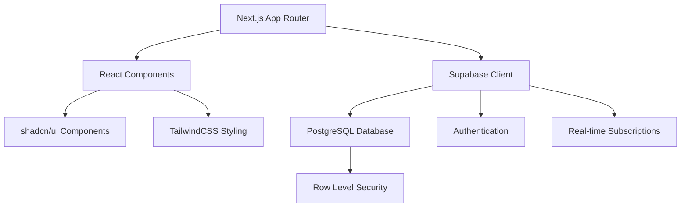
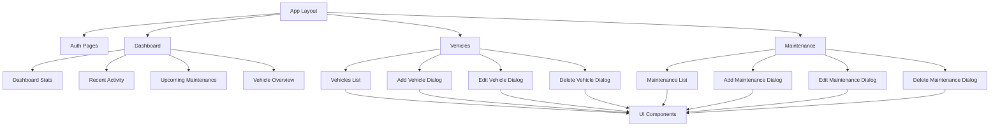
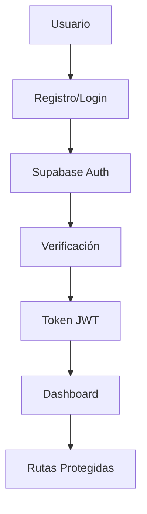
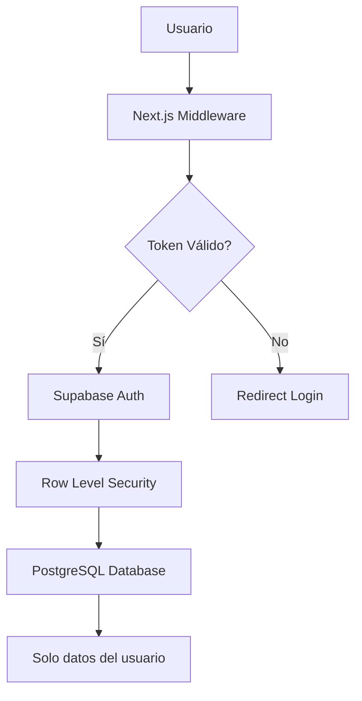
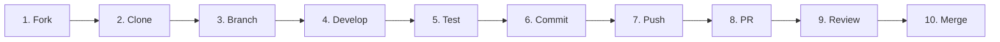

# 🚗 CarCare Pro

<p align="center">
  <strong>Sistema completo de gestión de mantenimiento automotriz</strong>
</p>

<p align="center">
  Una aplicación web moderna y completa para gestionar el mantenimiento de vehículos, construida con Next.js, TailwindCSS y Supabase.
</p>

<p align="center">
  <a href="#demo">Ver Demo</a> •
  <a href="#características">Características</a> •
  <a href="#instalación">Instalación</a> •
  <a href="#documentación">Documentación</a> •
  <a href="#contribuir">Contribuir</a>
</p>

---

[](https://nextjs.org/)
[](https://reactjs.org/)
[](https://www.typescriptlang.org/)
[](https://supabase.com/)
[](https://tailwindcss.com/)
[](https://opensource.org/licenses/MIT)

## 📸 Demo

> 🚧 **Nota**: Las capturas de pantalla serán agregadas próximamente

<div align="center">
  
  <p><em>Dashboard principal con estadísticas y vista general</em></p>
</div>

<details>
<summary>Ver más capturas de pantalla</summary>

|                      Gestión de Vehículos                      |                     Historial de Mantenimiento                     |
| :------------------------------------------------------------: | :----------------------------------------------------------------: |
|  |  |

</details>

## ✨ Características

<table>
<tr>
<td>

### 🚙 **Gestión de Vehículos**

- Registro completo de vehículos
- Información detallada (marca, modelo, año, VIN)
- Control de kilometraje
- Edición y eliminación segura

</td>
<td>

### 📅 **Programación de Servicios**

- Recordatorios de mantenimiento
- Programación de servicios futuros
- Notificaciones automáticas
- Calendario integrado

</td>
</tr>
<tr>
<td>

### 💰 **Control de Gastos**

- Seguimiento de costos detallado
- Análisis de gastos por período
- Reportes financieros
- Gráficos y estadísticas

</td>
<td>

### 📋 **Historial Completo**

- Registro detallado de servicios
- Notas y observaciones
- Archivos adjuntos
- Exportación de datos

</td>
</tr>
<tr>
<td>

### 📊 **Dashboard Intuitivo**

- Vista general centralizada
- Estadísticas en tiempo real
- Próximos mantenimientos
- Actividad reciente

</td>
<td>

### 🔐 **Seguridad Avanzada**

- Autenticación con Supabase
- Protección de rutas
- Row Level Security (RLS)
- Sesiones seguras

</td>
</tr>
</table>

### 🎨 **Experiencia de Usuario**

- 📱 **Responsive Design**: Funciona perfectamente en móviles, tablets y desktop
- 🌙 **Modo Oscuro**: Tema adaptable según preferencias del usuario
- ♿ **Accesibilidad**: Cumple con estándares WCAG
- ⚡ **Rendimiento**: Optimizado para carga rápida
- 🌐 **PWA Ready**: Preparado para funcionar como aplicación web progresiva

## 🛠️ Stack Tecnológico

<div align="center">

|                                               Frontend                                               |                                        Backend & Database                                         |                                       Tools & Utilities                                       |
| :--------------------------------------------------------------------------------------------------: | :-----------------------------------------------------------------------------------------------: | :-------------------------------------------------------------------------------------------: |
|           |  |  |
|                       |   |                                        |
|  |                              |                   |
|                                 |                             |                                |

</div>

### Arquitectura



### Características Técnicas

- **🏗️ App Router**: Utilizando el nuevo App Router de Next.js 14
- **🎨 Design System**: Componentes consistentes con shadcn/ui
- **🔄 Real-time**: Actualizaciones en tiempo real con Supabase
- **📱 Progressive Web App**: Preparado para funcionar offline
- **🔒 Type Safety**: TypeScript en toda la aplicación
- **✅ Form Validation**: Validación robusta con Zod y React Hook Form

## 📋 Requisitos Previos

Antes de comenzar, asegúrate de tener instalado:

| Requisito                                                                                     | Versión           | Enlace                                   |
| --------------------------------------------------------------------------------------------- | ----------------- | ---------------------------------------- |
|        | 18.0.0 o superior | [Descargar](https://nodejs.org/)         |
|        | Última versión    | [Instalar](https://pnpm.io/installation) |
|  | Cuenta gratuita   | [Registrarse](https://supabase.com/)     |

> 💡 **Tip**: También puedes usar `npm` o `yarn`, pero recomendamos `pnpm` para un mejor rendimiento.

## 🚀 Instalación

### Método Rápido (Recomendado)

```bash
# 1. Clonar el repositorio
git clone https://github.com/devchemical/CarCare.git
cd CarCare

# 2. Instalar dependencias
pnpm install

# 3. Configurar variables de entorno
cp .env.example .env.local
# Edita .env.local con tus credenciales de Supabase

# 4. Ejecutar la aplicación
pnpm dev
```

### Instalación Paso a Paso

<details>
<summary><strong>📖 Guía Detallada de Instalación</strong></summary>

#### 1. Clonar el Repositorio

```bash
git clone https://github.com/devchemical/CarCare.git
cd CarCare
```

#### 2. Instalar Dependencias

**Con pnpm (recomendado):**

```bash
pnpm install
```

**Con npm:**

```bash
npm install
```

**Con yarn:**

```bash
yarn install
```

#### 3. Configurar Supabase

1. **Crear proyecto en Supabase**

   - Ve a [supabase.com](https://supabase.com)
   - Crea una nueva organización y proyecto
   - Anota la URL y las claves API

2. **Configurar variables de entorno**

   Crea un archivo `.env.local` en la raíz del proyecto:

```env
# Supabase Configuration
NEXT_PUBLIC_SUPABASE_URL=tu_supabase_url
NEXT_PUBLIC_SUPABASE_ANON_KEY=tu_supabase_anon_key
SUPABASE_SERVICE_ROLE_KEY=tu_service_role_key

# Development URL
NEXT_PUBLIC_DEV_SUPABASE_REDIRECT_URL=http://localhost:3000/dashboard

# Production URL (opcional)
NEXT_PUBLIC_SUPABASE_REDIRECT_URL=https://tu-dominio.com/dashboard
```

#### 4. Configurar Base de Datos

**Opción A: Usar la interfaz de Supabase**

1. Ve a tu proyecto en Supabase
2. Navega a "SQL Editor"
3. Ejecuta los scripts en orden:
   - `scripts/001_create_tables.sql`
   - `scripts/002_create_profile_trigger.sql`

**Opción B: Usar CLI de Supabase (Avanzado)**

```bash
# Instalar Supabase CLI
npm install -g @supabase/cli

# Hacer login
supabase login

# Ejecutar migraciones
supabase db push
```

#### 5. Ejecutar la Aplicación

```bash
# Desarrollo
pnpm dev

# Construcción para producción
pnpm build
pnpm start
```

</details>
### 🗄️ Configuración de Base de Datos

<details>
<summary><strong>📋 Scripts SQL para Supabase</strong></summary>

#### Script 1: Crear Tablas Principales

Ejecuta `scripts/001_create_tables.sql` en el editor SQL de Supabase:

```sql
-- Tabla de perfiles de usuario
CREATE TABLE profiles (
  id UUID REFERENCES auth.users(id) PRIMARY KEY,
  email TEXT NOT NULL,
  full_name TEXT,
  created_at TIMESTAMP WITH TIME ZONE DEFAULT NOW(),
  updated_at TIMESTAMP WITH TIME ZONE DEFAULT NOW()
);

-- Tabla de vehículos
CREATE TABLE vehicles (
  id UUID DEFAULT gen_random_uuid() PRIMARY KEY,
  user_id UUID REFERENCES profiles(id) ON DELETE CASCADE NOT NULL,
  make TEXT NOT NULL,
  model TEXT NOT NULL,
  year INTEGER NOT NULL,
  license_plate TEXT,
  vin TEXT,
  color TEXT,
  mileage INTEGER DEFAULT 0,
  created_at TIMESTAMP WITH TIME ZONE DEFAULT NOW(),
  updated_at TIMESTAMP WITH TIME ZONE DEFAULT NOW()
);

-- Tabla de registros de mantenimiento
CREATE TABLE maintenance_records (
  id UUID DEFAULT gen_random_uuid() PRIMARY KEY,
  vehicle_id UUID REFERENCES vehicles(id) ON DELETE CASCADE NOT NULL,
  type TEXT NOT NULL,
  description TEXT,
  cost DECIMAL(10,2),
  mileage INTEGER,
  service_date DATE NOT NULL,
  next_service_date DATE,
  notes TEXT,
  created_at TIMESTAMP WITH TIME ZONE DEFAULT NOW(),
  updated_at TIMESTAMP WITH TIME ZONE DEFAULT NOW()
);

-- Habilitar Row Level Security
ALTER TABLE profiles ENABLE ROW LEVEL SECURITY;
ALTER TABLE vehicles ENABLE ROW LEVEL SECURITY;
ALTER TABLE maintenance_records ENABLE ROW LEVEL SECURITY;

-- Políticas de seguridad...
-- (Ver archivo completo en scripts/001_create_tables.sql)
```

#### Script 2: Crear Triggers

Ejecuta `scripts/002_create_profile_trigger.sql`:

```sql
-- Función para crear perfil automáticamente
CREATE OR REPLACE FUNCTION public.handle_new_user()
RETURNS TRIGGER AS $$
BEGIN
  INSERT INTO public.profiles (id, email, full_name)
  VALUES (NEW.id, NEW.email, NEW.raw_user_meta_data->>'full_name');
  RETURN NEW;
END;
$$ LANGUAGE plpgsql SECURITY DEFINER;

-- Trigger para crear perfil cuando se registra un usuario
CREATE OR REPLACE TRIGGER on_auth_user_created
  AFTER INSERT ON auth.users
  FOR EACH ROW EXECUTE FUNCTION public.handle_new_user();
```

</details>

---

### ▶️ Ejecutar la Aplicación

Una vez configurado todo, ejecuta:

```bash
pnpm dev
```

🎉 **¡Listo!** La aplicación estará disponible en `http://localhost:3000`

### 🌐 Despliegue

<details>
<summary><strong>Opciones de Despliegue</strong></summary>

#### Vercel (Recomendado)

[](https://vercel.com/new/clone?repository-url=https://github.com/devchemical/CarCare)

#### Netlify

[](https://app.netlify.com/start/deploy?repository=https://github.com/devchemical/CarCare)

#### Railway

[](https://railway.app/new/template/your-template)

**Variables de entorno necesarias:**

- `NEXT_PUBLIC_SUPABASE_URL`
- `NEXT_PUBLIC_SUPABASE_ANON_KEY`
- `SUPABASE_SERVICE_ROLE_KEY`
- `NEXT_PUBLIC_SUPABASE_REDIRECT_URL`

</details>

## 📁 Estructura del Proyecto

```
CarCare/
├── 📁 app/                          # Next.js App Router
│   ├── 🔐 auth/                     # Páginas de autenticación
│   │   ├── login/                   # Inicio de sesión
│   │   ├── signup/                  # Registro de usuario
│   │   ├── signup-success/          # Confirmación de registro
│   │   └── error/                   # Página de errores
│   ├── 📊 dashboard/                # Dashboard principal
│   ├── 🚗 vehicles/                 # Gestión de vehículos
│   │   └── [id]/maintenance/        # Mantenimiento por vehículo
│   ├── layout.tsx                   # Layout principal
│   ├── page.tsx                     # Landing page
│   └── globals.css                  # Estilos globales
├── 📁 components/                   # Componentes React
│   ├── dashboard/                   # Componentes del dashboard
│   │   ├── dashboard-stats.tsx      # Estadísticas generales
│   │   ├── recent-activity.tsx      # Actividad reciente
│   │   ├── upcoming-maintenance.tsx # Próximos mantenimientos
│   │   └── vehicle-overview.tsx     # Vista general de vehículos
│   ├── vehicles/                    # Componentes de vehículos
│   │   ├── add-vehicle-dialog.tsx   # Diálogo agregar vehículo
│   │   ├── edit-vehicle-dialog.tsx  # Diálogo editar vehículo
│   │   ├── delete-vehicle-dialog.tsx# Diálogo eliminar vehículo
│   │   └── vehicles-list.tsx        # Lista de vehículos
│   ├── maintenance/                 # Componentes de mantenimiento
│   │   ├── add-maintenance-dialog.tsx    # Agregar mantenimiento
│   │   ├── edit-maintenance-dialog.tsx   # Editar mantenimiento
│   │   ├── delete-maintenance-dialog.tsx # Eliminar mantenimiento
│   │   └── maintenance-list.tsx          # Lista de mantenimientos
│   ├── ui/                          # Componentes UI (shadcn/ui)
│   │   ├── button.tsx               # Botones personalizados
│   │   ├── dialog.tsx               # Diálogos modales
│   │   ├── input.tsx                # Campos de entrada
│   │   ├── card.tsx                 # Tarjetas de contenido
│   │   └── ...                      # Más componentes UI
│   └── theme-provider.tsx           # Proveedor de tema
├── 📁 lib/                          # Utilidades y configuración
│   ├── utils.ts                     # Funciones de utilidad
│   └── supabase/                    # Configuración de Supabase
│       ├── client.ts                # Cliente de Supabase
│       ├── server.ts                # Cliente del servidor
│       └── middleware.ts            # Middleware de autenticación
├── 📁 scripts/                      # Scripts SQL de base de datos
│   ├── 001_create_tables.sql        # Creación de tablas
│   └── 002_create_profile_trigger.sql # Triggers de perfiles
├── 📁 public/                       # Archivos estáticos
│   ├── placeholder-logo.svg         # Logo del proyecto
│   └── ...                          # Imágenes y assets
├── 📄 middleware.ts                 # Middleware de Next.js
├── 📄 next.config.mjs               # Configuración de Next.js
├── 📄 tailwind.config.js            # Configuración de TailwindCSS
├── 📄 tsconfig.json                 # Configuración de TypeScript
└── 📄 package.json                  # Dependencias del proyecto
```

### 🏗️ Arquitectura de Componentes



## 🎯 Funcionalidades Principales

### 🔐 Sistema de Autenticación

<table>
<tr>
<td width="50%">

**Características de Seguridad:**

- ✅ Registro con email y contraseña
- ✅ Verificación de email automática
- ✅ Inicio de sesión seguro
- ✅ Recuperación de contraseña
- ✅ Protección de rutas con middleware
- ✅ Gestión automática de sesiones
- ✅ Tokens JWT seguros

</td>
<td width="50%">

**Flow de Autenticación:**



</td>
</tr>
</table>

### 🚗 Gestión Completa de Vehículos

| Función                | Descripción                           | Estado |
| ---------------------- | ------------------------------------- | ------ |
| **Agregar Vehículo**   | Registro completo con todos los datos | ✅     |
| **Editar Información** | Actualización de datos existentes     | ✅     |
| **Eliminar Vehículo**  | Borrado seguro con confirmación       | ✅     |
| **Vista de Lista**     | Listado con información resumida      | ✅     |
| **Búsqueda/Filtros**   | Encontrar vehículos rápidamente       | 🚧     |
| **Importar/Exportar**  | Gestión masiva de datos               | 🔄     |

**Información que se gestiona:**

- 📋 Datos básicos (marca, modelo, año, color)
- 🔢 Números de identificación (VIN, placa)
- 📏 Control de kilometraje actual
- 📅 Fechas de compra y registro
- 💰 Valor del vehículo
- 📎 Documentos y fotos

### 🔧 Sistema de Mantenimiento Avanzado

<details>
<summary><strong>Ver funcionalidades de mantenimiento</strong></summary>

#### Tipos de Mantenimiento Soportados

- 🛢️ **Cambio de aceite y filtros**
- 🔧 **Mantenimiento preventivo**
- ⚙️ **Reparaciones mecánicas**
- 🚗 **Servicios de carrocería**
- 🔋 **Sistema eléctrico**
- 🛞 **Neumáticos y alineación**
- ❄️ **Aire acondicionado**
- 🔍 **Inspecciones técnicas**

#### Características Principales

- 📅 **Programación inteligente** de próximos servicios
- 💰 **Control detallado** de costos por servicio
- 📊 **Reportes** de gastos por período
- 🔔 **Notificaciones** de mantenimientos próximos
- 📋 **Notas** y observaciones detalladas
- 📎 **Archivos adjuntos** (facturas, fotos)
- 📈 **Análisis** de patrones de mantenimiento

</details>

### 📊 Dashboard Inteligente

El dashboard centraliza toda la información importante:

<table>
<tr>
<td width="25%">

**📈 Estadísticas**

- Total de vehículos
- Mantenimientos del mes
- Gastos acumulados
- Próximos servicios

</td>
<td width="25%">

**🕒 Actividad Reciente**

- Últimos mantenimientos
- Nuevos vehículos
- Actualizaciones
- Recordatorios

</td>
<td width="25%">

**⏰ Próximos Servicios**

- Mantenimientos pendientes
- Fechas importantes
- Alertas por kilometraje
- Recordatorios automáticos

</td>
<td width="25%">

**🚗 Vista General**

- Estado de vehículos
- Resumen de costos
- Gráficos de rendimiento
- Acciones rápidas

</td>
</tr>
</table>

## 🔒 Seguridad y Privacidad

<div align="center">

|       🛡️ Característica       |             📋 Descripción             |  ✅ Estado   |
| :---------------------------: | :------------------------------------: | :----------: |
| **Row Level Security (RLS)**  |  Cada usuario solo accede a sus datos  | Implementado |
|     **Autenticación JWT**     | Tokens seguros manejados por Supabase  | Implementado |
| **Validación de Formularios** | Validación cliente y servidor con Zod  | Implementado |
| **Middleware de Protección**  |    Rutas protegidas automáticamente    | Implementado |
|   **Encriptación de Datos**   | Datos encriptados en tránsito y reposo | Por defecto  |
|   **Auditoría de Accesos**    |  Registro de actividades del usuario   | Planificado  |

</div>

### 🔐 Arquitectura de Seguridad



### 🛡️ Implementación de RLS

Las políticas de seguridad garantizan que:

- ✅ Los usuarios solo ven **sus propios vehículos**
- ✅ Los mantenimientos están **asociados al propietario**
- ✅ No hay **acceso cruzado** entre usuarios
- ✅ Las operaciones están **auditadas** automáticamente

---

## 🎨 Diseño y Experiencia de Usuario

### 🌈 Sistema de Diseño

<table>
<tr>
<td width="33%">

**🎨 Paleta de Colores**

- 🟢 **Primario**: Verde profesional
- ⚫ **Neutro**: Grises modernos
- 🔴 **Alertas**: Rojos para advertencias
- 🔵 **Información**: Azules para datos

</td>
<td width="33%">

**📱 Responsive Design**

- 📱 **Mobile First**: Optimizado para móviles
- 📱 **Tablet Ready**: Funcional en tablets
- 💻 **Desktop**: Experiencia completa
- 🖥️ **Large Screens**: Aprovecha espacio extra

</td>
<td width="33%">

**♿ Accesibilidad**

- 🔤 **ARIA Labels**: Etiquetas descriptivas
- ⌨️ **Navegación**: Uso completo con teclado
- 🎯 **Contraste**: Cumple estándares WCAG
- 🔊 **Screen Readers**: Compatible

</td>
</tr>
</table>

### 🎭 Temas y Personalización

- 🌞 **Modo Claro**: Interfaz brillante y limpia
- 🌙 **Modo Oscuro**: Reducción de fatiga visual
- 🎨 **Personalización**: Colores adaptables
- 💾 **Persistencia**: Preferencias guardadas

---

## 📱 Guía de Uso

### 🚀 Primeros Pasos

<details>
<summary><strong>1. 📝 Registro e Inicio de Sesión</strong></summary>

1. **Crear cuenta nueva:**

   - Ve a `/auth/signup`
   - Completa email, nombre y contraseña
   - Verifica tu email
   - Serás redirigido al dashboard

2. **Iniciar sesión:**
   - Ve a `/auth/login`
   - Ingresa email y contraseña
   - Accede directamente al dashboard

</details>

<details>
<summary><strong>2. 🚗 Gestionar Vehículos</strong></summary>

1. **Agregar primer vehículo:**

   - Desde el dashboard, click "Agregar Vehículo"
   - Completa información básica (marca, modelo, año)
   - Agrega datos opcionales (placa, VIN, color)
   - Guarda y verifica en la lista

2. **Editar vehículo:**
   - Ve a la lista de vehículos
   - Click en el botón de editar
   - Modifica la información necesaria
   - Confirma los cambios

</details>

<details>
<summary><strong>3. 🔧 Registrar Mantenimientos</strong></summary>

1. **Primer mantenimiento:**

   - Selecciona un vehículo
   - Click "Agregar Mantenimiento"
   - Elige tipo de servicio
   - Ingresa fecha, costo y detalles
   - Programa próximo servicio (opcional)

2. **Ver historial:**
   - Desde la página del vehículo
   - Revisa todos los servicios anteriores
   - Filtra por tipo o fecha
   - Exporta reportes

</details>

<details>
<summary><strong>4. 📊 Usar el Dashboard</strong></summary>

- **Vista general:** Estadísticas principales en la parte superior
- **Próximos servicios:** Lista de mantenimientos pendientes
- **Actividad reciente:** Últimas acciones realizadas
- **Acciones rápidas:** Botones para funciones comunes

</details>

## 🤝 Contribuir al Proyecto

¡Nos encanta recibir contribuciones! Hay muchas formas de ayudar a mejorar CarCare Pro.

### 🎯 Formas de Contribuir

<table>
<tr>
<td width="25%">

**🐛 Reportar Bugs**

- Abre un [issue](https://github.com/devchemical/CarCare/issues)
- Describe el problema detalladamente
- Incluye pasos para reproducir
- Agrega capturas si es necesario

</td>
<td width="25%">

**✨ Nuevas Características**

- Propón ideas en [Discussions](https://github.com/devchemical/CarCare/discussions)
- Abre un issue con tu propuesta
- Espera feedback antes de desarrollar
- Sigue las pautas del proyecto

</td>
<td width="25%">

**📖 Documentación**

- Mejora el README
- Agrega comentarios al código
- Crea guías de usuario
- Traduce contenido

</td>
<td width="25%">

**🧪 Testing**

- Escribe pruebas unitarias
- Reporta problemas de usabilidad
- Prueba en diferentes dispositivos
- Valida accesibilidad

</td>
</tr>
</table>

### 🔄 Proceso de Contribución



#### Pasos Detallados

1. **🍴 Fork el Repositorio**

   ```bash
   # Crea tu fork desde GitHub UI
   ```

2. **📥 Clona tu Fork**

   ```bash
   git clone https://github.com/tu-usuario/CarCare.git
   cd CarCare
   ```

3. **🌿 Crea una Rama**

   ```bash
   git checkout -b feature/nombre-descriptivo
   # o
   git checkout -b fix/descripcion-del-bug
   ```

4. **💻 Desarrolla tu Característica**

   ```bash
   # Instala dependencias
   pnpm install

   # Ejecuta en modo desarrollo
   pnpm dev

   # Haz tus cambios...
   ```

5. **✅ Prueba tus Cambios**

   ```bash
   # Ejecuta linting
   pnpm lint

   # Construye el proyecto
   pnpm build

   # Prueba manualmente
   ```

6. **📝 Commit con Conventional Commits**

   ```bash
   git add .
   git commit -m "feat: agrega función de exportar datos"
   # o
   git commit -m "fix: corrige error en validación de formularios"
   ```

7. **📤 Push y Pull Request**

   ```bash
   git push origin feature/nombre-descriptivo
   ```

   Luego crea un Pull Request desde GitHub UI.

### 📋 Pautas de Contribución

<details>
<summary><strong>🎨 Estándares de Código</strong></summary>

#### TypeScript

- ✅ Usa tipos estrictos
- ✅ Evita `any`
- ✅ Documenta funciones complejas
- ✅ Usa interfaces para objetos

#### React/Next.js

- ✅ Componentes funcionales con hooks
- ✅ Usa Server Components cuando sea posible
- ✅ Props tipadas con TypeScript
- ✅ Manejo de errores apropiado

#### Styling

- ✅ TailwindCSS para estilos
- ✅ Usa componentes de shadcn/ui
- ✅ Mantén consistencia visual
- ✅ Responsive design obligatorio

#### Base de Datos

- ✅ Usa Row Level Security
- ✅ Valida datos en servidor
- ✅ Manejo de errores de DB
- ✅ Migraciones documentadas

</details>

<details>
<summary><strong>📝 Conventional Commits</strong></summary>

Usamos [Conventional Commits](https://www.conventionalcommits.org/) para mantener un historial limpio:

- `feat:` Nueva característica
- `fix:` Corrección de bugs
- `docs:` Cambios en documentación
- `style:` Cambios de formato (no afectan lógica)
- `refactor:` Refactorización de código
- `test:` Agregar o modificar pruebas
- `chore:` Mantenimiento y tareas auxiliares

**Ejemplos:**

```bash
feat(vehicles): agrega filtro por marca
fix(auth): corrige redirección después del login
docs(readme): actualiza guía de instalación
```

</details>

### 🏆 Reconocimientos

Todos los contribuidores aparecerán en nuestra sección de reconocimientos:

<!-- ALL-CONTRIBUTORS-BADGE:START - Do not remove or modify this section -->

[](#contributors)

<!-- ALL-CONTRIBUTORS-BADGE:END -->

## Contributors ✨

Gracias a todas estas personas maravillosas ([emoji key](https://allcontributors.org/docs/en/emoji-key)):

<!-- ALL-CONTRIBUTORS-LIST:START - Do not remove or modify this section -->
<!-- prettier-ignore-start -->
<!-- markdownlint-disable -->
<table>
  <tr>
    <td align="center"><a href="https://github.com/devchemical"><br /><sub><b>DevChemical</b></sub></a><br /><a href="https://github.com/devchemical/CarCare/commits?author=devchemical" title="Code">💻</a> <a href="#design-devchemical" title="Design">🎨</a> <a href="https://github.com/devchemical/CarCare/commits?author=devchemical" title="Documentation">📖</a></td>
  </tr>
</table>

<!-- markdownlint-restore -->
<!-- prettier-ignore-end -->

<!-- ALL-CONTRIBUTORS-LIST:END -->

Este proyecto sigue la especificación de [all-contributors](https://github.com/all-contributors/all-contributors). ¡Las contribuciones de cualquier tipo son bienvenidas!

## �️ Roadmap

### 🎯 Versión Actual (v1.0)

- ✅ Autenticación segura con Supabase
- ✅ Gestión completa de vehículos
- ✅ Sistema de mantenimiento
- ✅ Dashboard con estadísticas
- ✅ Diseño responsive
- ✅ Row Level Security

### 🚀 Próximas Características (v1.1)

- 🔄 **API REST completa** para integraciones
- 📱 **Aplicación móvil nativa** (React Native)
- 🔔 **Notificaciones push** para recordatorios
- 📊 **Reportes avanzados** con gráficos mejorados
- 🌍 **Internacionalización** (i18n) multi-idioma
- 🔍 **Búsqueda avanzada** con filtros múltiples

### 🎨 Mejoras Futuras (v1.2+)

- 🤖 **IA para predicción** de mantenimientos
- 📸 **OCR para facturas** automático
- 🔗 **Integración con talleres** mecánicos
- 💳 **Gestión de presupuestos** y finanzas
- 🚗 **Comparador de costos** entre vehículos
- 📈 **Analytics avanzados** de rendimiento

<details>
<summary><strong>Ver roadmap detallado</strong></summary>

| Característica       | Prioridad |      Estado      | Versión Estimada |
| -------------------- | :-------: | :--------------: | :--------------: |
| API REST             |  🔥 Alta  |  🔄 En progreso  |       v1.1       |
| App Móvil            |  🔥 Alta  |  📋 Planificado  |       v1.1       |
| Notificaciones Push  |  🔥 Alta  |  📋 Planificado  |       v1.1       |
| Reportes Avanzados   | 🟡 Media  |  📋 Planificado  |       v1.1       |
| Multi-idioma         | 🟡 Media  |  📋 Planificado  |       v1.1       |
| OCR para Facturas    | 🟡 Media  | 💡 Investigación |       v1.2       |
| IA Predictiva        |  🔵 Baja  | 💡 Investigación |       v2.0       |
| Integración Talleres |  🔵 Baja  | 💡 Investigación |       v2.0       |

</details>

¿Quieres influir en el roadmap? [Únete a las discusiones](https://github.com/devchemical/CarCare/discussions) o [propón nuevas características](https://github.com/devchemical/CarCare/issues/new?assignees=&labels=enhancement&template=feature_request.md).

---

## �📄 Licencia

Este proyecto está bajo la **Licencia MIT**. Esto significa que puedes:

- ✅ **Usar** el código para cualquier propósito
- ✅ **Modificar** el código según tus necesidades
- ✅ **Distribuir** copias del software
- ✅ **Incluir** en proyectos comerciales
- ✅ **Hacer fork** y crear versiones derivadas

**Únicos requisitos:**

- 📄 Incluir el archivo de licencia original
- 👤 Dar crédito al autor original

Ver el archivo [`LICENSE`](LICENSE) para más detalles.

---

## 🆘 Soporte y Ayuda

### 🤔 ¿Necesitas Ayuda?

<table>
<tr>
<td width="25%">

**📖 Documentación**

- [README completo](README.md)
- [Guía de instalación](#instalación)
- [Estructura del proyecto](#estructura-del-proyecto)
- [Pautas de contribución](#contribuir-al-proyecto)

</td>
<td width="25%">

**🐛 Reportar Problemas**

- [Issues de GitHub](https://github.com/devchemical/CarCare/issues)
- [Template de bug report](https://github.com/devchemical/CarCare/issues/new?template=bug_report.md)
- [Buscar problemas existentes](https://github.com/devchemical/CarCare/issues?q=is%3Aissue)

</td>
<td width="25%">

**💬 Discusiones**

- [GitHub Discussions](https://github.com/devchemical/CarCare/discussions)
- [Preguntas y respuestas](https://github.com/devchemical/CarCare/discussions/categories/q-a)
- [Ideas y sugerencias](https://github.com/devchemical/CarCare/discussions/categories/ideas)

</td>
<td width="25%">

**📚 Recursos Externos**

- [Documentación de Supabase](https://supabase.com/docs)
- [Documentación de Next.js](https://nextjs.org/docs)
- [TailwindCSS Docs](https://tailwindcss.com/docs)
- [shadcn/ui Components](https://ui.shadcn.com/)

</td>
</tr>
</table>

### 📧 Contacto Directo

- **📧 Email**: [soporte@carcare.dev](mailto:soporte@carcare.dev)
- **🐦 Twitter**: [@CarCareDev](https://twitter.com/CarCareDev)
- **💼 LinkedIn**: [CarCare Pro](https://linkedin.com/company/carcare-pro)

### ⚡ Tiempo de Respuesta

- 🐛 **Bugs críticos**: 24-48 horas
- 🔧 **Problemas técnicos**: 2-5 días laborales
- 💡 **Nuevas características**: 1-2 semanas
- 📖 **Documentación**: 1-3 días laborales

---

<div align="center">

## 🌟 ¡Apoya el Proyecto!

<p>Si CarCare Pro te ha sido útil, considera:</p>

[](https://github.com/devchemical/CarCare/stargazers)
[](https://github.com/devchemical/CarCare/network/members)
[](https://github.com/devchemical/CarCare/watchers)

<p>⭐ <strong>Dar una estrella al repositorio</strong></p>
<p>🔄 <strong>Compartir con otros desarrolladores</strong></p>
<p>🤝 <strong>Contribuir con código o documentación</strong></p>
<p>💡 <strong>Proponer nuevas características</strong></p>

---


**CarCare Pro** - _Mantén tus vehículos en perfecto estado_ 🚗✨

Desarrollado con ❤️ por [DevChemical](https://github.com/devchemical)

---

<sub>© 2024 CarCare Pro. Todos los derechos reservados bajo la Licencia MIT.</sub>

</div>
